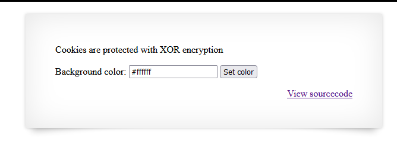
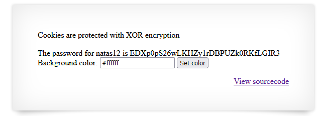

# Writeup level 11
We are greeted by a site where we can set the background color. Looking at the source code we can see that there is a cookie that gets xor encrypted.  
 


**Source Code**

```php
<?

$defaultdata = array( "showpassword"=>"no", "bgcolor"=>"#ffffff");

function xor_encrypt($in) {
    $key = '<censored>';
    $text = $in;
    $outText = '';

    // Iterate through each character
    for($i=0;$i<strlen($text);$i++) {
    $outText .= $text[$i] ^ $key[$i % strlen($key)];
    }

    return $outText;
}

function loadData($def) {
    global $_COOKIE;
    $mydata = $def;
    if(array_key_exists("data", $_COOKIE)) {
    $tempdata = json_decode(xor_encrypt(base64_decode($_COOKIE["data"])), true);
    if(is_array($tempdata) && array_key_exists("showpassword", $tempdata) && array_key_exists("bgcolor", $tempdata)) {
        if (preg_match('/^#(?:[a-f\d]{6})$/i', $tempdata['bgcolor'])) {
        $mydata['showpassword'] = $tempdata['showpassword'];
        $mydata['bgcolor'] = $tempdata['bgcolor'];
        }
    }
    }
    return $mydata;
}

function saveData($d) {
    setcookie("data", base64_encode(xor_encrypt(json_encode($d))));
}

$data = loadData($defaultdata);

if(array_key_exists("bgcolor",$_REQUEST)) {
    if (preg_match('/^#(?:[a-f\d]{6})$/i', $_REQUEST['bgcolor'])) {
        $data['bgcolor'] = $_REQUEST['bgcolor'];
    }
}

saveData($data);


?>
```

**What is happening here?**  
When you open the website for the first time default data is being loaded. This default data consists out of two properties with default values, being the **showpassword** property set to **no** and the **bgcolor** property set to **#fffff**. We can modify the bgcolor property through the input field like shown in the screenshot above.  
So what happens when we save our data? First the data gets json encoded, after that it gets xor encrypted and finally it gets base64 encoded. This base64 String gets saved in the cookie called data. The application loads the data from that cookie and kind of does the reverse to decrypt it. So it starts by decoding the base64 string, then xor decrypts its content and finally json decodes the json object back to an php array.

## XOR Encryption
When you are using XOR to encrypt something you have a major problem when the plaintext is known.  
You have a plaintext **p**, a key **k** and a **XOR** function that recieves both as arguments.  
So lets say we have our:  
**plaintext**: HelloWorld  
**key**: ABCD  
Our XOR function works like the one in the php code above:  
So we take the H from our plaintext and XOR it with A.  
We get some strange character but it doesn't matter. Next we are going to XOR e with B, l with C, l with D and then start over with the key. So o with A, W with B and so on.  
As the result we are going to concat all of the strange characters and call it our cipher text.  
So when we XOR our plaintext with our key we get our cipher text but what if we XOR our cipher text with our plain text?  
Correct! We get the key. That's how XOR works.

## Back to the challenge
What we need to do now is to find out what is the plaintext and what is the cipher text. The **plain text** is the default data i.e. the **defaultdata** array above the xor_encrypt function.  
The **cipher text** is the **cookie** or rather said the base64 decoded cookie since the json objects are getting xor'ed.  
We are going to use the xor_encrypt function from the victim to get the key.  
**key** = pw8J  
Since we know the key, we can build our own json object now with the showpassword property set to yes.  
After that we base64 encode the json object and replace our default cookie with it.  

**Exploit**

```php
#!/usr/bin/env php

<?php
$defaultdata = array( "showpassword"=>"no", "bgcolor"=>"#ffffff");

function xor_encrypt($in, $key2) {
    $key = $key2;
    $text = $in;
    $outText = '';

    // Iterate through each character
    for($i=0;$i<strlen($text);$i++) {
    $outText .= $text[$i] ^ $key[$i % strlen($key)];
    }

    return $outText;
}

# xor
# plain ^ key = cipher
# cipher ^ plain = key

$data = "ClVLIh4ASCsCBE8lAxMacFMZV2hdVVotEhhUJQNVAmhSEV4sFxFeaAw=";
$data_decoded = base64_decode($data);
$defaultdata_json = json_encode($defaultdata);

var_dump(xor_encrypt($data_decoded, $defaultdata_json));

# key = qw8J

$payload = array( "showpassword"=>"yes", "bgcolor"=>"#ffffff");
$key = 'qw8J';
$cookie = base64_encode(xor_encrypt(json_encode($payload), $key));

var_dump($cookie);

?>

```


**Result**

 

The password is:  
EDXp0pS26wLKHZy1rDBPUZk0RKfLGIR3
