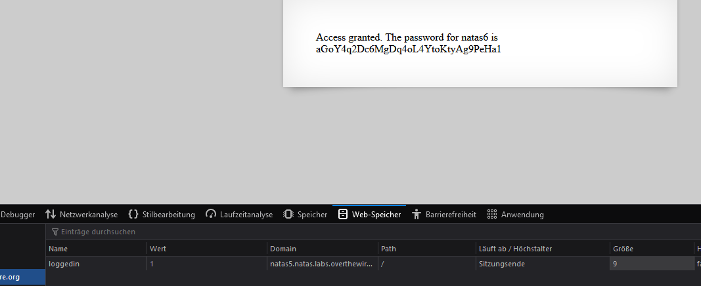

# Writeup level 5
In this challenge the website is telling us that we have no access because we are not logged in.  
Since there is no login form we can assume that we have to check out the session management.  
In the web-storage we can check out the cookies.  
We can see that there is a cookie named "loggedin" and it's set to 0 (which usually stands for the boolean value false). By changing the value to 1 (which usually stands for the boolean value true), we can get access to the website.

The password is:  
aGoY4q2Dc6MgDq4oL4YtoKtyAg9PeHa1
