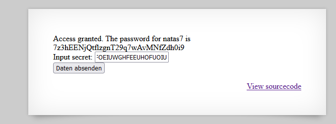

# Writeup level 6
In this challenge we have to submit the secret and we have a input field where we can type in that secret. Also the creator of this challenge was so generous to give us the source code.  
Let's dig in the source code:

```php
<?
include "includes/secret.inc";

    if(array_key_exists("submit", $_POST)) {
        if($secret == $_POST['secret']) {
        print "Access granted. The password for natas7 is <censored>";
    } else {
        print "Wrong secret";
    }
    }
?>
```

Okay so basically the variable **$secret** is in a file called **secret.inc** and this variable get's loaded into this file by using **include**. Our task is now to get access to that file so we can see what String is saved in the variable **$secret**.  
Let's try to access that file by changing the URL (Directory Traversal Attack) to :  
*http://natas6.natas.labs.overthewire.org/includes/secret.inc*  
We get a blank page. But don't get fooled by it. Check the source file!  
Content of the source file:  
```php
<?
$secret = "FOEIUWGHFEEUHOFUOIU";
?>
```
After typing in the secret we get the password.



The password is:  
7z3hEENjQtflzgnT29q7wAvMNfZdh0i9

## Little fun fact
```php
if($secret == $_POST['secret'])
```
The double equals in PHP are called loose equality operators and are also a potential attack vector (**not in this case though!**).
