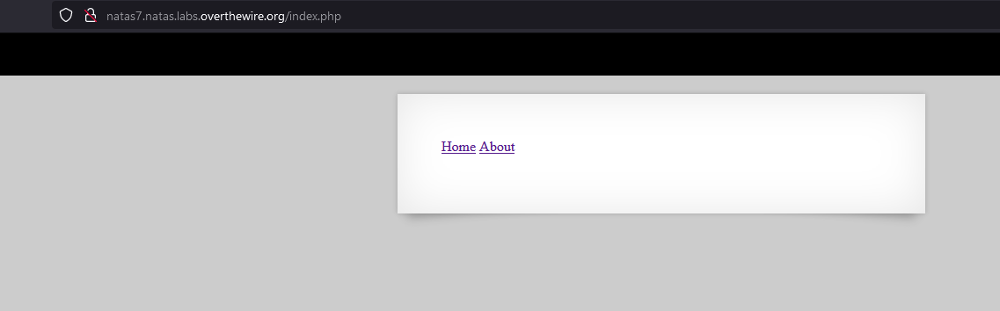
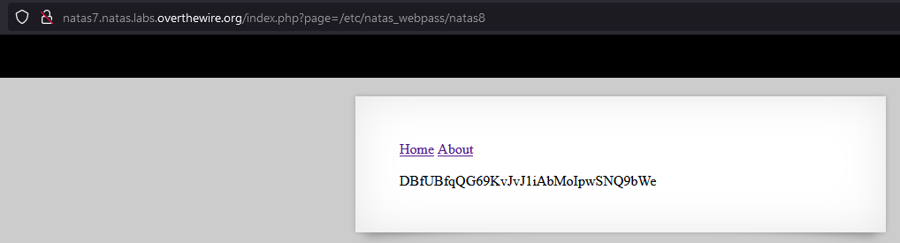

# Writeup level 7
We get greeted with two links leading to the Home and About Page.
  
When we click on the Home Link the URL changes to:  
*http://natas7.natas.labs.overthewire.org/index.php?page=home*  
The GET-Parameter **page** looks very intresting ;).

Let's try to get some more information. Check the source file.  
```
<!-- hint: password for webuser natas8 is in /etc/natas_webpass/natas8 -->
```
Oh nice a hint! So we have to get the content of the **/etc/natas_webpass/natas8**

## Local File Inclusion

>Local file inclusion (also known as LFI) is the process of including files that are already locally present on the server, through the exploitation of vulnerable inclusion procedures implemented in the application. 
https://cobalt.io/blog/a-pentesters-guide-to-file-inclusion

## Back to the challange

Like I said before the GET-Parameter **page** looks very intresting. That's because we can see that pages named home and about are getting loaded when we modify it by clicking on the links. So nothing is stopping us from changing that value in the URL to something malicious. Let's try to use the **Local File Inclusion (LFI)** Attack.  

By setting the GET-paramter **page** to the absolute path (which we know from the hint) of the natas8 password file, the content of the file get's loaded into the webpage.

 

The password is:  
DBfUBfqQG69KvJvJ1iAbMoIpwSNQ9bWe
