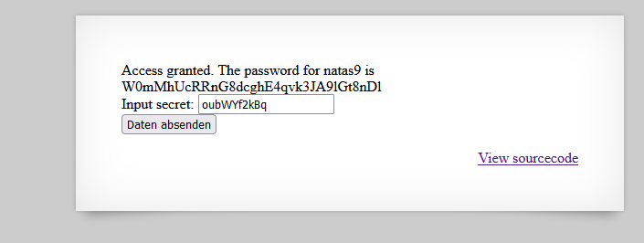

# Writeup level 8
Like in an earlier challenge that we had we got greeted by a input field where we have to enter a secret and also the creator of the challenge again gave us the source code.

Source Code:

```php
<?

$encodedSecret = "3d3d516343746d4d6d6c315669563362";

function encodeSecret($secret) {
    return bin2hex(strrev(base64_encode($secret)));
}

if(array_key_exists("submit", $_POST)) {
    if(encodeSecret($_POST['secret']) == $encodedSecret) {
    print "Access granted. The password for natas9 is <censored>";
    } else {
    print "Wrong secret";
    }
}
?>
```

Okay so this looks like an poor attempt to encrypt a String (in this case the secret).

```php
function encodeSecret($secret) {
    return bin2hex(strrev(base64_encode($secret)));
}
```
Since we know the function that is used to "encrypt" the String and the encodedSecret, we can simply reverse it and get the original data out of it.  
So the function first encodes the secret in base64, then reverses that base64 string and finally converts the String into hex.  

## How do we reverse that function?
We can simply write our own PHP function that does the opposite.  

1. Transform the hex String into binary data
2. Reverse the String
3. Decode the base64 String

```php
function decodeSecret($secret){
	return base64_decode(strrev(hex2bin($secret)));
}
```

**Complete Source Code**
```php
<?php

$encodedSecret = "3d3d516343746d4d6d6c315669563362";

function decodeSecret($secret){
	return base64_decode(strrev(hex2bin($secret)));
}

echo(decodeSecret($encodedSecret));

?>
```

Output:  
oubWYf2kBq

 

The password is:  
W0mMhUcRRnG8dcghE4qvk3JA9lGt8nDl

