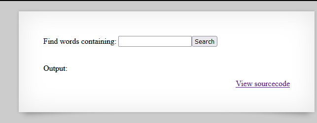

# Writeup level 9

So in this challenge we can type a String into a input field and search a file. Luckily we can see how this whole thing is programmed by checking out the source code.

 

**Source Code**


```php
<?
$key = "";

if(array_key_exists("needle", $_REQUEST)) {
    $key = $_REQUEST["needle"];
}

if($key != "") {
    passthru("grep -i $key dictionary.txt");
}
?>
```

As we can see the programm is using the **grep** command to filter for Strings in the file dictionary.txt. Also there is no restrictions to the input, meaning that we can try to exploit this through a **command injection**.

## What is a Command Injection?
>Command injection is an attack in which the goal is execution of arbitrary commands on the host operating system via a vulnerable application. https://owasp.org/www-community/attacks/Command_Injection

## Back to the challenge
Okay so what does the -i option do in grep?  
From the man page:
>-i, --ignore-case
>              Ignore  case  distinctions,  so that characters that differ
>              only in case match each other.

$key is our input  
dictionary.txt is the target file

So what if our input doesn't look like the programmer intended it to look like. Lets say for instance we do something like this:  
our input: **a /etc/natas_webpass/natas10;**  
how it looks like in the end for the application:  
**grep -i a /etc/natas_webpass/natas10; dictionary.txt**

### Why did I choose "a" for grep?
Since I don't know how the password looks like I would just check for each character one-by-one. Of course I could write a script for this and don't do it manually but in this case I had a match on my first attempt so I didn't bother doing it.

### Result
 

The password is:  
nOpp1igQAkUzaI1GUUjzn1bFVj7xCNzu
